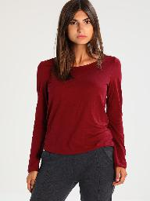
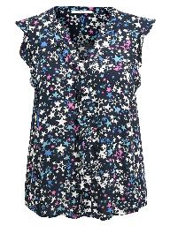
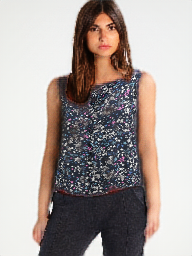

### A Virtual fitting room for those who love to Shop Online! Shopping Made easier at Home!

  
   
   

Presentation:
Power point Presentation can be found in the project by name: Virtual_Dressing_Room.pptx

## Important Note

This repository is made just for demo purposes only and it utilizes a publicly 
available clothing transfer model.
  
## PreRequisites

* [Conda]
* [Octave 4.2+]

## Notebooks

This repo includes some jupyter notebooks (located in `notebooks/`) that may be useful for understanding the SmartFit pipeline and its inputs/outputs. Exact usage instructions are at the top of each notebook.

* `visualize_inputs.ipynb`
  * Explains and shows the main inputs to the clothing transfer model: body mask, face and pants, keypoint pose map, and clothing item.
* `visualize_output.ipynb`
  * Displays the output image.
* `skintone_check.ipynb`
  * Describes how the skintone check works. This is a check to make sure that the clothing transfer model did not change the skintone of the inputted person.

## References

This project builds from the work listed below:

* Image parsing
  * LIP_JPPNet ([repo](https://github.com/Engineering-Course/LIP_JPPNet))
* Image Pose
  * Realtime Multi-Person Pose Estimation ([repo](https://github.com/ZheC/Realtime_Multi-Person_Pose_Estimation))
    * [Keras implementation](https://github.com/michalfaber/keras_Realtime_Multi-Person_Pose_Estimation)
* Virtual tryVirtualDress
  * VITON ([repo](https://github.com/xthan/VITON), [paper](https://arxiv.org/abs/1711.08447))
